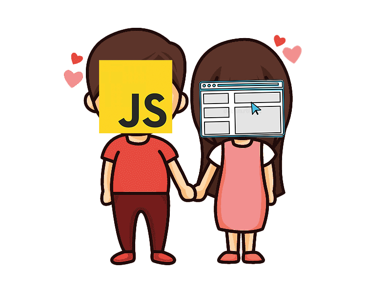

# Intro to Async JS, APIs & Fetch

* In *synchronous* operations tasks are performed one at a time and only when one is completed, the following is unblocked. In other words, you need to wait for a task to finish to move to the next one.

* In *asynchronous* operations, on the other hand, you can move to another task before the previous one finishes. This way, with asynchronous programming you’re able to deal with multiple requests simultaneously, thus completing more tasks in a much shorter period of time.  

## Non-Blocking
  * JavaScript is a non-blocking language.
  * It will move onto the next line of code after execution, even if that line of code is not finished running.

## JavaScript is SINGLE-THREADED
  ### Synchronous
  * At any given point in time, that single JS thread is running at most, one line of code. *We can only do one thing at a time.*

  

  * **REAL WORLD EXAMPLE: SYNCHRONOUS**
    - You go to the grocery store & there is only a single checkout lane. (Single Threaded)
    - The line moves one person at a time, in order and another person cannot be helped until the current customer is finished. (Synchronous)

## Introducing... Asychronous JavaScript! 
  * But what happens if our code NEEDS TIME to finish what it's doing before we move onto the next thing?
  * GOOD NEWS!! The browser has some tricks up it's sleeve to get around JavaScript's single-threaded-ness.
  * JavaScript will still only be doing one thing at a time, but the browser can do us some big favors (with the power of callback functions!).
  * Callback functions allow us to execute functions at the appropriate time. (Think event listeners!)
  * We know that these callback functions work, but how do they work? Why do they work? Afterall, JavaScript only does one thing at a time!
  * JavaScript actually depends on the browser to keep track of what is supposed to happen and when.

  

  * JavaScript and the browser are TWO SEPARATE things. 
  * JavaScript is a language that works in our browser.
    *(Fun Fact: Browsers are usually written in C++.)*
  * Browsers come with something called a Web API. The Web API is able to handle certain tasks in the background, like making a request or setting a timer.
  

  * **REAL WORLD EXAMPLE - ASYNCHRONOUS:**
    - You put your clothes in the washer. The washing machine does the work and when it’s finished, it buzzes or somehow alerts you and you put your clothes in the dryer.

  *IT IS OKAY if this doesn't make sense to you right away. It is a concept that people generally need to digest over time.*

  

## Event Loop
  * The Event Loop has ONE job-- to monitor the call stack and the callback queue. 
  * Call Stack: *a mechanism that helps the JavaScript interpreter to keep track of the function that a script calls*
  * Callback Queue: *where your asynchronous code gets pushed to, and waits for the execution.*
  * Web API: *provides the ability to queue tasks to be executed automatically at the appropriate time*


## APIs
  * What is an API?
    - Information stored on web servers that can be used to populate info into our applications.
    - Note: The internet calls A LOT of things APIs.
  * APIs are essentially back-end applications on servers with routes that receive requests and return information.
  * We will be working with data in JSON format, but there are other formats you'll see used (like YAML or XML) -- but we don't need to worry about any of those ATM.


## Promises
  * A promise is an object that represents the eventual completion or failure of an asynchronous operation.
  * Very much like a real world promise. 
    - I promise I’ll do something when… 
    - but! There is no guarantee that I’ll keep that promise. You’ll just have to wait and see. 
  * Promises are a pattern for writing asynchronous code, we generally use them when we're requesting or sending information to an API.
  * Promises are OBJECTS that we attach callbacks to (instead of passing in as an argument like we would with something like an event listeners).

  

## Fetch
  * When we use `.fetch()` to send a request to some API, it returns a promise
    - Show example of a returned promise in the console.
  * A promise starts out pending and then is either resolved or rejected.
  * If the promise is resolved, it returns a response object.
    - Show in the console.
  * `.json()` is a method that belongs to the `Response` object.
  * Using `.json()` returns ANOTHER promise. That promise resolves with the result of parsing the body text (from `resp`) as JSON.
    - This method can seem a little misleading. The result is NOT JSON, but the result of taking JSON as an input and parsing it to RETURN A JS OBJECT.
    - Doing this takes TIME, so it returns a promise.
    - This promise is resolved with the data that is read and parsed from the response promise object.
    
  * Errors!
    * The `.catch()` method handles a promise being rejected.
    * When we use a URL that doesn’t exist and the website has a 404 error page, we’ll get an error, but NOT from our `.catch()` -- our code will try to parse the HTML from the 404 page. 
    * `.catch()` will NOT reject on an HTTP error status, even if the response is a 404 or 500. It resolves normally. `.catch()` will ONLY reject on network failure or if anything prevents the request from being completed. (Ex. if our internet is turned off)
    * Well, what the heck? What's even the point of `.catch()` then?
    * We can use our response object and conditionals to trick JavaScript into executing that `.catch()`.
      ```
        if (resp.ok) {
          // whatever we want our code to do with the information from the resolved resp promise.
        } else {
          throw new Error(`Status Code Error: ${response.status}`); // this triggers our .catch()
        }
      ``` 

  ## Async/Await
    * Refactor one of our existing requests to use async/await
    * `async` is used in front of function declarations or expressions to designate that it is asynchronous.
    * `async` functions ALWAYS return a promise.
    * If the function returns a value, the promise will be resolved with that value.
    * The `async` keyword is added to a function to tell it to return a promise rather than directly returning the value.
    * `await` can be put in front of any `async` promise based function to pause your code on that line until the promise is fulfilled and then return the resulting value.
    * `await` only works inside of `async` functions.
    
  
---

## External Resources
- [Async JavaScript Illustrated][async-visual]
- [JS Promises Illustrated][promises-visual]
- [THE EVENT LOOP VIDEO OF ALL EVENT LOOP VIDEOS][event-loop]
- [MDN Using `fetch`][using-fetch-mdn]
- [MDN Promises][mdn-promise]
- [Response][resp]
- [.json()][resp-json]
- [MDN MIME Types][mdn-mime-types]
- [JavaScript Visualizer][visualizer]

<!-- markdown vars -->
[json-server]: https://github.com/typicode/json-server
[using-fetch-mdn]: https://developer.mozilla.org/en-US/docs/Web/API/Fetch_API/Using_Fetch
[mdn-promise]: https://developer.mozilla.org/en-US/docs/Web/JavaScript/Reference/Global_Objects/Promise
[resp]: https://developer.mozilla.org/en-US/docs/Web/API/Response
[resp-json]: https://developer.mozilla.org/en-US/docs/Web/API/Response/json
[mdn-mime-types]: https://developer.mozilla.org/en-US/docs/Web/HTTP/Basics_of_HTTP/MIME_types
[visualizer]: https://www.jsv9000.app/
[async-visual]: https://dev.to/marinafroes/illustrated-js-javascript-asynchronous-behaviour-1akc
[promises-visual]: https://dev.to/marinafroes/illustrated-js-promises-5ed7
[event-loop]: https://www.youtube.com/watch?v=8aGhZQkoFbQ
